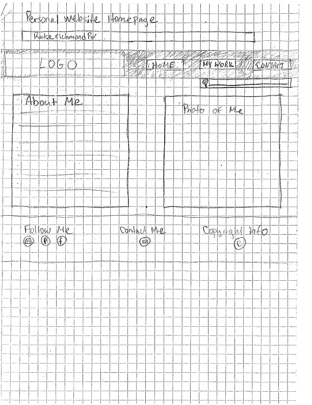

# My INF 7420 Project

Welcome to my web design project for INF 7420. I am building a personal website to showcase my work and expereince to prospective employers and build a professional presence on the web.

# Wireframes
Here are the wireframes that I've used for planning and designing my page.

Header - the header includes my name and logo, navigation menu, and search bar

Navigation menu - includes links to home, my work, and contact

Main Content - includes an about me section with basic personal information and professional goals and an adjacent photo of me

Footer - includes my social media links, email link, and copyright information

Header - the header includes my name and logo, navigation menu, and search bar

Navigation menu - includes links to home, my work, and contact

Main Content - includes a header that says my work and four main sections: library lists library experience and includes photos of library work I've completed, national service highlights my national service accomplishments and provides work samples on bottom, community service lists volunteer expereince and includes a photo slideshow, and education lists education and includes work samples. There is also a small below these sections that highlights my diverse work expereince.

Footer - includes my social media links, email link, and copyright information

Header - the header includes my name and logo, navigation menu, and search bar

Navigation menu - includes links to home, my work, and contact

Main Content - includes a header that says contact me, along with a contact form and personal photo of me with a caption reminiscent of a polaroid photo

Footer - includes my social media links, email link, and copyright information

This concludes my personal website.
